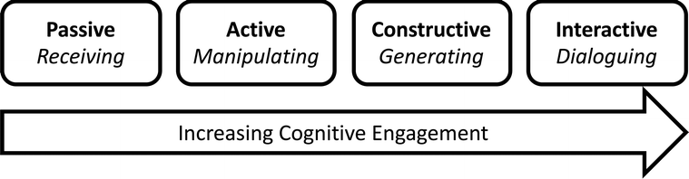
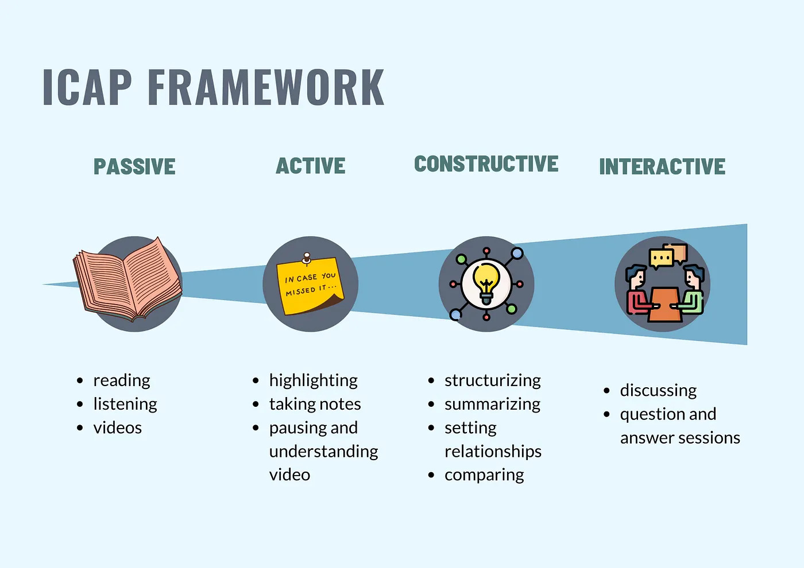
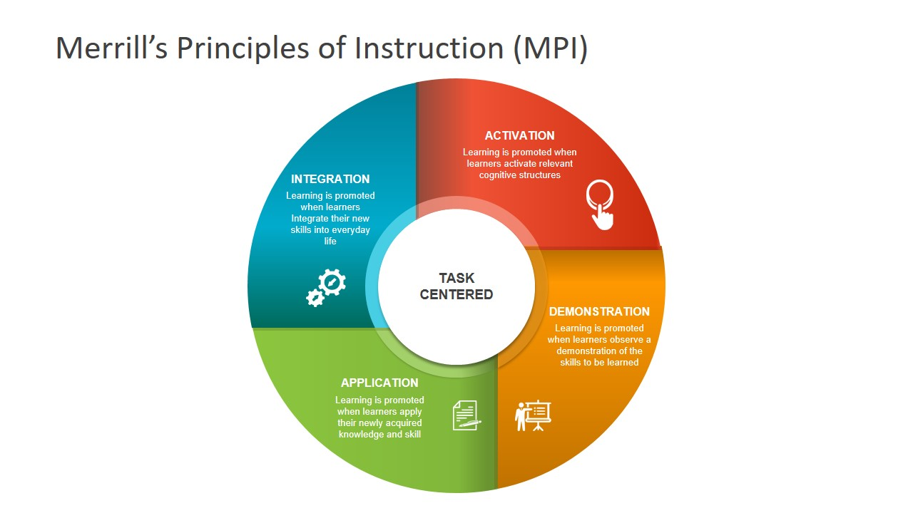

{fig-alt="an illustration of four students working toegether and discussing a project. there are books, papers, and pencils on the table as well as a computer."}

Good learning experiences don’t just happen – they are the product of careful planning and meticulous design. Interactive and multimedia learning design should always serve the learning objectives, so it’s important to know how an instructional designer would approach creating interactive and multimedia learning in support of a lesson or course. In this module, we take a look at some of the common instructional design and lesson planning principles and models that help us systematically plan learner-centred and effective learning experiences.  

In this module we also look at the benefits of active learning and explore some of the ways that media and multimedia can support these activities.

## Learning Outcomes

By the end of this module you will be able to: 

- Describe six strategies for bringing active learning into a learning environment with media or multimedia   
- Differentiate between active and passive learning   
- Describe Merrill’s Five Principles of Instruction.  
- Identify examples of media and multimedia activities that can be used to support Merrill’s principles in a learning environment.  
- Identify four evidence-based learner outcomes from using active learning in the classroom 

## Active Learning

<iframe src="https://edtechuvic.ca/edci337/wp-admin/admin-ajax.php?action=h5p_embed&id=12" width="678" height="806" frameborder="0" allowfullscreen="allowfullscreen" title="Drag and drop the activity to the correct category."></iframe>

Image credit: [Bryan Mathers](https://bryanmmathers.com/about/)

Active Learning is a set of teaching strategies that engages students as active participants in their own learning, on their own or in collaboration with others. In the traditional, teacher-centred lecture format, students are passive observers, ‘consumers’ of learning. Active learners are ‘producers’ of learning. Active learning is also closely associated with learning design strategies, such as student-centred learning (from Universal Design for Learning).

Research shows that this approach has many beneficial outcomes for learners including:

- Improved critical thinking/problem solving skills and increased content knowledge understanding in comparison to traditional lecture-based delivery [@andersonComparisonStudentPerformance2005]. 
- Greater persistence. Students in courses without active learning were 1.5 times more likely to fail than students in a course that included active learning [@freemanActiveLearningIncreases2014].  
- Increased enthusiasm for learning in both students and instructors [@thamanPromotingActiveLearning2013]. 
- Development of essential skills such as critical and creative thinking, adaptability, communication and interpersonal skills [@kemberInfluenceActiveLearning2005]. 

## Active vs. Passive Learning

So active learning improves learning outcomes and creates a better learning experience for both instructors and students. Why would you ever do anything else? While it’s critical to include active learning in our lesson plans, sometimes passive learning can be a useful tool for introducing new terminology or foundational knowledge. We’ve already established that storytelling is a powerful teaching strategy which doesn’t appear to inspire active learning but actually generates a lot of physical and mental responses. Watching a demonstration, reading an essay, listening to a story – these can provide valuable learning experiences that can be reinforced with active learning. Sometimes in our eagerness to add active learning to our teaching, we forget that there needs to be some scaffolding of knowledge and skill in order for students to be able to complete the activity successfully. As a teacher you need to be able to recognize the strengths of both types of learning to use them effectively.

{fig-alt="“Modes of cognitive engagement (in bold) and characteristic behavior (in italics) according to the ICAP framework” from Investigating small-group cognitive engagement in general chemistry learning activities using qualitative content analysis and the ICAP framework by El-Mansy, Barbera & Hartig (2021) https://pubs.rsc.org/en/content/articlehtml/2022/rp/d1rp00276g"} 

Image source: [@el-mansyInvestigatingSmallgroupCognitive2022]

Taking this concept one step further, researchers Chi and Willie [-@chiICAPFrameworkLinking2014], introduce the ICAP framework, offering four modes of engagement.

The ICAP Framework theorizes that increased cognitive engagement leads to an increase in learning. Learning activities can be designed in order to facilitate an increased cognitive engagement.

 

Image source: @nellihelaScienceEfficientLearning2023

## Active Learning and Multimedia

Adding active learning to media and multimedia design can be as simple as adding questions before, during or after viewing media. It can also mean building in much more complex interactivity, such as branching scenarios and interactive case studies. However, complexity does not always equal better outcomes for learners. As always, we want to make sure that our multimedia tools and content serve the learning objectives. Sometimes the simplest approach with the fewest barriers provides the best outcomes.

Some examples of the ways that multimedia can support active learning include:

- Providing platforms for expression and reflection ([WordPress](https://wordpress.org), [ArcGIS Storymaps](https://storymaps.arcgis.com/)). 
- Social annotation of content ([Hypothes.is](https://web.hypothes.is/), [VideoAnt](https://ant.umn.edu/)). 
- Conceptual mapping ([Canva](https://www.canva.com/), [Free Mind](https://freemind.sourceforge.net/wiki/index.php/Main_Page)). 
- Collaborative writing and publishing ([Pressbooks](https://pressbooks.bccampus.ca/), [Scalar](https://scalar.me/anvc/scalar/features/)). 
- Discussion and communication ([Mattermost](https://mattermost.org), [Discord](https://discord.com/), [Slack](https://slack.com/))

## Merrill’s Principles of Instruction

One of the most useful learning theories from an active learning design perspective is Merrill’s First Principles of Instruction. If you’re an Education student you have no doubt come across this before in your studies. 

{fig-alt="a circular diagram showing merrills first principles of instruction"}

Image source: @merrillFirstPrinciplesInstruction2002

Merrill’s First Principles are focused on a problem-solving approach to learning design. What authentic problem can we solve with this lesson that is meaningful to learners? He theorized that learning is promoted when:

- Learners are engaged in solving **real-world problems**. 
- Existing knowledge is **activated as a foundation for new knowledge**. 
- New knowledge is **demonstrated to the learner**. 
- New knowledge is **applied by the learner**. 
- New knowledge is **integrated into the learner’s world**. 

So how do we facilitate this process with the use of media and multimedia? By helping to create an environment where this type of learning can take place. As Merrill himself pointed out in the video in Read/Watch this week, just the use of media and multimedia doesn’t promote learning. It’s how you use them that counts. Here are some examples:

### Activation and Demonstration

- Videos can show real-world examples and demonstrate procedures. 
- Animations can demonstrate complex systems in ways that aren’t visible to the human eye.  
- Infographics can help learners activate past knowledge by giving them a quick reference to remind them of key terminology and information. 
- Augmented reality can be overlaid on an environment to show hidden information in context

### Application

- Interactive activities can supply quick formative feedback on learning concepts. 
- Branched scenarios can be used to explore a complex case study. 
- Simulations can provide decision-making practice in a semblance of real-world scenarios. 

And of course an interactive multimedia learning object like a branched scenario simulation could encompass all of these principles -- it could simulate a real-world problem, activate prior learning, demonstrate and then allow the learner to practice and integrate the knowledge, skill or attitude.

## Read/Watch 

[Lessons in Learning](https://news.harvard.edu/gazette/story/2019/09/study-shows-that-students-learn-more-when-taking-part-in-classrooms-that-employ-active-learning-strategies/)  (5 min)
: A summary of the landmark study from Harvard University about the impacts and challenges of Active Learning.   

[To Learn Students Need to DO Something](https://www.cultofpedagogy.com/do-something/) (15 min) 
: A reflection on the need for active learning in K-12 along with some suggestions for classroom activities   

[Game-based Learning](https://www.youtube.com/watch?v=n2EV8nLeBK4) (5 min) 
: Using game-based learning to tell a story about the history of civilization using active learning.  

[Merrill’s First Principle of Instruction](https://www.james-greenwood.com/instructional-design/toolkit/merrill/#:~:text=The%20premise%20of%20Merrill%E2%80%99s%20first%20principles%20of%20instruction,principles%20are%20necessary%20for%20effective%20and%20efficient%20instruction.%E2%80%9D%28p44%29) (20 min) 
: A synthesis of Merrill’s principles from an instructional design perspective. 

[Merrill on Instructional Design](https://youtu.be/i_TKaO2-jXA) (5 min)
: Merrill is one of the pioneers of modern instructional design thinking from a problem-centred perspective. He reflects here in particular on multimedia design and delivery. 

[What Is Scaffolding in Education? | GCU Blog](https://www.gcu.edu/blog/teaching-school-administration/what-scaffolding-education) (10 min) 
: What do we mean when we talk about scaffolding in education? 

[Active Learning Overview](https://youtu.be/zoa2pKYp_fk) (5 min) 
: An overview of active learning and its importance in learning design.  

[An Active Learning Example](https://youtu.be/RzbWSnb3kHs) (4 min) 
: Active learning activity design in a physics lab.  

[Active Learning in STEM](https://www.youtube.com/watch?v=Ol3WabrXcR4) (5 min) 
: Active learning at work in a STEM class. 

## Reflections

As always, these questions are intended as an inspiration for your blogs, not a prescription. So use one of the questions if it sparks ideas or choose your own reflection on this week’s topic.

- What is your experience with video game learning supports? Which principles (Mayer’s and Merrill’s) seem to be commonly applied in in-game support and which ones are often missed in your experience?  
- What authentic problem would you use to design a lesson using Merrill’s principles? What media or multimedia (interactive or not) would you create to support it?  
- Where do you see constructive alignment and backward design used in this course or another course you are taking/have taken? Is there anywhere where it seems to be missing?  
- Historia, the example of game-based learning in this week’s Read/Watch list is relatively low tech – how would you use multimedia tools and content to support and enhance the active learning? What would it allow them to do that they’re not doing right now?  
- How have you found the balance of passive and active learning in this course for your learning? How does it compare to your experience in other courses?  
- In the reading, Students Need to DO Something, do any of the author’s experiences with passive learning in K-12 classrooms resonate with your own? Why do you think active learning is not more prevalent in K-12? Have you tried using any of these activities in a classroom? Which one looks most appealing to you?

## Further Reading

Looking for a deeper dive? Explore some of these references:

Biggs, John, [Constructive Alignment in University Teaching](https://www.herdsa.org.au), HERDSA Review of Higher Education Vol. 1

Kurt, S. “[Instructional Design Models and Theories](https://educationaltechnology.net/instructional-design-models-and-theories/),” in Educational Technology, December 9, 2015. 

Wiggins, G. and McTighe, J. Understanding by Design. 2nd ed. 2005. Web.

Boulenger, Véronique, Olaf Hauk, Friedemann Pulvermüller, [Grasping Ideas with the Motor System: Semantic Somatotopy in Idiom Comprehension](https://doi.org/10.1093/cercor/bhn217), Cerebral Cortex, Volume 19, Issue 8, August 2009, Pages 1905–1914, 

Burrows, S., Collier, A. et al. [The Asynchronous Cookbook](https://pressbooks.middcreate.net/asynchronouscookbook/), Office of Digital Learning & Inquiry, Middlebury College

[Centre for Teaching Excellence, Active Learning Activities | Centre for Teaching Excellence | University of Waterloo](https://uwaterloo.ca/centre-for-teaching-excellence/catalogs/tip-sheets/active-learning-activities)  CC-BY-NC

Chow, H. M., Mar, R. A., Xu, Y., Liu, S., Wagage, S., & Braun, A. R. (2014). [Embodied comprehension of stories: interactions between language regions and modality-specific neural systems](https://doi.org/10.1162/jocn_a_00487). Journal of cognitive neuroscience, 26(2), 279-295.

Ferster, Bill (2016-11-15). [Sage on the screen: education, media, and how we learn.](https://muse.jhu.edu/book/48032)

Glonek, Katie L. & Paul E. King (2014) [Listening to Narratives: An Experimental Examination of Storytelling in the Classroom](https://doi.org/10.1080/10904018.2014.861302), International Journal of Listening, 28:1, 32-46.

González, Julio, Alfonso Barros-Loscertales, Friedemann Pulvermüller, Vanessa Meseguer, Ana Sanjuán, Vicente Belloch, César Ávila, [Reading cinnamon activates olfactory brain regions](https://doi.org/10.1016/j.neuroimage.2006.03.037), NeuroImage, Volume 32, Issue 2, 2006, Pages 906-912.

Mathers, B. (2017). [Wikipedia – Active vs Passive learning](https://bryanmmathers.com/wikipedia-active-vs-passive-learning/).  CC-BY-ND 

::: {.callout-note}

This post has been adapted from:   
- [Mary Watt](https://edtechuvic.ca/edci337/2023/10/20/module-4-principles-of-learning-design-and-active-learningoct-29-nov-11/).   
- [Adrian Granchelli](https://edtechuvic.ca/edci337/2025/10/19/models-of-active-learning/). P

:::

