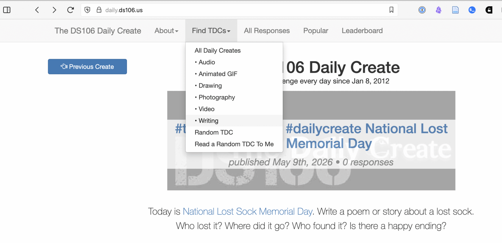

{fig-alt="Plate of pink-frosted cookies on a white cabinet with a vase of red-and-yellow tulips, all in front of a chalkboard that reads 'Do small things with great love' in calligraphy"}
Image Credits^[Calligraphy Credit: Kelly Madland, Cookie Credit: Kelly Madland, Photo Credit: Colin Madland]

This ongoing assignment will be your opportunity to play with various forms of media. There are six ‘working’ weeks throughout the course and in each of those weeks, you will experiment with creating small media artifacts. At the end of each week, you will summarize your learning and the process you used to learn throughout the week.

I **really** want you to play and experiment with these activities without fear of ‘losing marks’. The process is the point here. You have a lot of freedom to direct your learning towards your own interests, but there are some guidelines I want you to follow.

## Schedule

I want you to focus on some discrete media formats in each week as follows.

| Week	| Media Focus |
| --- | --- |
| May 11–17 |	Text |
| May 18–24	| Audio |
| May 25–31	| Image |
| June 1–7	| Video |
| June 8–14 |	Multimedia |
| June 15–26 |	Data Visualisation |

As inspiration, you will use a site called [‘Today’s Daily Create‘ (TDC)](https://daily.ds106.us/) to find a brief challenge related to our weekly media focus. For example, during week one, visit the TDC site and use the ‘Find TDCs’ menu item and choose ‘Writing’ to filter all the writing prompts. You can see below that the TDC for May 9, 2026 is to write a brief poem for National Lost Sock Memorial Day. Choose one of the prompts from the list, and spend 10 minutes or so responding to the prompt.

You can complete these activities using digital tools (not AI), such as an app on a computer, phone, or tablet, or you can use analog technologies like a pen or pencil and paper (although you will need to scan or take a picture to digitize your artifact.)

You should try to complete 3-5 TDCs on each weekly media focus. The more you can do the better. These activities are required, but will not be graded, except for the fact that they will form the basis for some graded activities in the rest of the class. By Sunday evening of each week, you will create a post on your blog where you tell the story of what you learned about creating using that particular media format during the week. It doesn’t matter if your media starts out at potato quality. Everyone stinks when they try something new. The important thing is to practice over the week and document your learning. In your posts, you must connect your process and learning to the theories we learn about in class (multimedia learning theory, accessibility, design thinking, active learning, and storytelling.)

[An example of what I am looking for is from Libby Heeren’s blog, linked here,](https://libbyheeren.com/blog/2024-03-13_ellsworth-part-1/) who documented her process of learning to code a complex app to replicate a piece of art that she liked.

## AI Use
You all know there are hundreds of AI tools available that can make it look like you did this work, but choosing to use those tools will reduce the value of what you learn from this course. I want to hear from YOU. Your ideas and contributions are what matter.

Calligraphy Credit: Kelly Madland

Cookie Credit: Kelly Madland

Photo Credit: Colin Madland