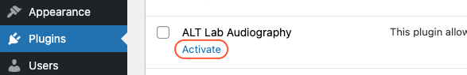

Super quick update...

## ALT Lab Audiography

I just discovered that there is a plugin in your opened.ca site called 'ALT Lab Audiography', which seems to allow you to annotate audio files directly in WordPress.

I have never used this plugin, but you may want to try it out.

{fig-alt="plugin in WordPress called ALT Lab Audiography"}

## Activation

Navigate to your Dashboard > Plugins, then click 'Activate' on the plugin.