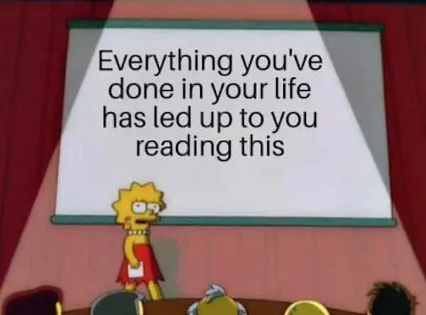
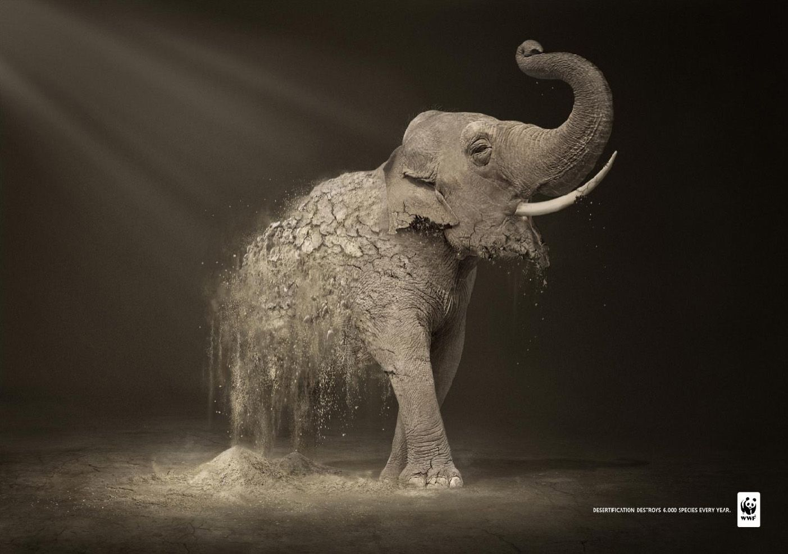
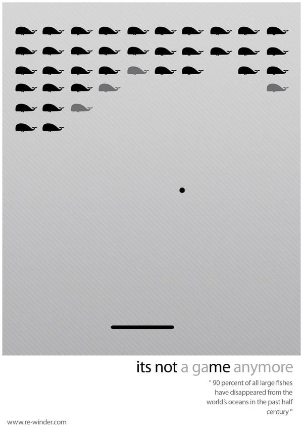

Using text and image together can lead to better learning due to the dual-coding theory – that there are two separate parts of our brains to process textual/verbal vs. visual information. In other words our brain can handle more content if it’s in the form of text AND image; our brain has a limit of how much textual content it can handle and a different limit of the imagery content it can handle. To dive deeper, the act of comprehending and constructing mental models from text undergoes a different neural process than if the stimuli is imagery.

 > “students usually learn better from words and pictures than from words alone” [@schnotzIntegratedModelText2014, p. 92] <!-- (Schnotz, 2022, p. 92) -->

The popularity of memes is no surprise, as they represent a powerful combination of text and image; an immediate visual understanding and textual context.

{fig-alt="Lisa Simpson standing in front of a presentation screen that reads 'Everything you've done in your life leads up to reading this.'"}

As you read on, I want you to reflect upon your personal experiences with text and imagery. Think about how each medium influences your learning, how you communicate with friends and family, and how advertising may leverage forms of media.

::: {.columns}

::: {.column}

:::

::: {.column}

:::

:::

> Meaningful learning from text and pictures requires a coordinated set of cognitive processes, including the selection of information, organization of information, activation of prior knowledge, and active coherence formation by integrating information from different sources. In the comprehension of written or spoken texts, the learner selects relevant verbal information from words, sentences, and paragraphs as an external source of information. He or she organizes the information, activates related prior knowledge as an internal source of information, and constructs both a coherent propositional representation and a coherent mental model. In the comprehension of visual pictures, the learner selects relevant pictorial information from a drawing, a map, or a graph as an external source of information, organizes the information, activates related prior knowledge as a further source of information, and constructs a coherent mental model complemented by a propositional representation. [@schnotzIntegratedModelText2014, p. 91] <!--(Schnotz, 2022, p. 91)-->

<!-- A cartoon/comic book style illustration of a personified book and a personified Polaroid picture, both wearing standard red boxing gloves and engaged in a dynamic, comical fight. The Polaroid is punching, and the book is dodging, all in a lighthearted mood. There is no background
Gemini Flash 2.5 (2025) -->

It is important to know the strengths and weaknesses of each media so that multimedia compliment instead of undermine one another. There is no optimal media (text nor image) but there is potentially a better choice for what you are communicating. We can frame the differences of image and text as speed vs. depth, appearances vs. analysis, and emotion vs. reason [@yousmanTextImageMedia2016]. <!-- (Yousman, 2015) -->

::: {.columns}

::: {.column}
## IMAGE

### Speed
- quick to process  
- discourage lingering

### Appearances

- instantaneous meaning  
- not implicitly subject to analysis

### Emotion:
- Emotionally captivating  
- Emotional immediacy
:::

::: {.column}

## TEXT

### Depth
- cultivates intellectual exploration  

### Analysis
- Sequential and deliberate  
- Requires cognitive effort

### Reason

- Justifiable  
- Coherent
:::

:::

	
	
> “When learners have low prior knowledge, mental model construction from written text can become too difficult. Adding a picture as another source of information can then enhance comprehension, because it offers an additional route for mental model construction.” [@schnotzIntegratedModelText2014, p. 91]

<!-- (Schnotz, 2022, p. 91) -->

## Text + Image ≠ Best Learning

While text and image recruit different neural pathways, the combination of text and image does not always lead to better learning. In fact, when text and image are used together poorly, it can have a negative effect on learning. Let’s explore each of the principles of Mayer’s Cognitive Theory of Multimedia Learning that may be affected:

Redundancy Principle
: If a learner does not need two information sources, i.e. if they have strong prior knowledge, then offering both image and text provides extraneous cognitive load.

Coherence and Contiguity
: If there is too much time or distance between textual information and visual information then the learner will not easily connect the image with the text.

## Read/Watch

Here is a list of media and multimedia illustrating and expanding on the ideas and techniques introduced. Although there may be some repetition between sources, looking at a variety of examples can greatly help your understanding of the underlying theories.

This is a quick fantastic overview of Dual Coding and how it is the leading theory over Learning Styles.

Verbal to Visual. (2025). Learning Styles vs Dual Coding: A Battle of Two Theories. YouTube. 



This is more visual focused and design focused but highlights some of the principles well.
Peck, D. (2021). Visual Design Principles for eLearning. YouTube. 



A little overview over different graphics to support learning.

Sentz, J. (2021). [Using Visual and Graphic Elements While Designing Instructional Activities. Design for Learning: Principles, Processes, and Praxis](https://edtechbooks.org/id/using_visual_and_graphic_elements).

Lots of good examples in this overview of dual coding theory.

Loveless, B. (2023). [Dual Coding Theory: The Complete Guide for Teachers](https://www.educationcorner.com/dual-coding-theory/). Education Corner. 

<!-- References
Looking for a deeper dive into some of these ideas? Check out some of the references below.

Schnotz, W. (2022). Integrated model of text and picture comprehension. In R. E. Mayer & L. Fiorella (Eds.), The Cambridge handbook of multimedia learning (3rd ed., pp. 83–99). Cambridge University Press.

Yousman, B. (2015). The Text and the Image: Media Literacy, Pedagogy, and Generational Divides. In J. Frechette & R. Williams (Eds.), Media Education for a Digital Generation (pp. 157–170). Routledge. https://doi.org/10.4324/9781315682372 -->

## Reflection Questions
These questions are here to prompt your thinking about the content. Hint: you can elaborate in your substantive post.

Consider your favourite social media platform. How does it leverage the combination of text and image to keep you engaged?
After reading this, what considerations will you consider when designing content for education?
When you attend a lecture and take notes, do you ever find yourself doodling or creating small diagrams? Does this help your writing? Why or why not?